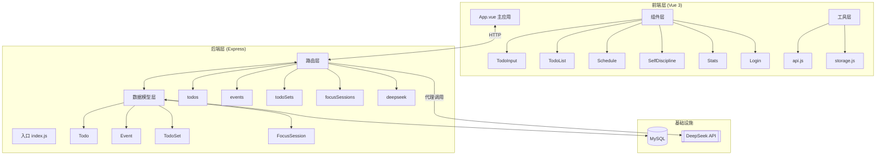
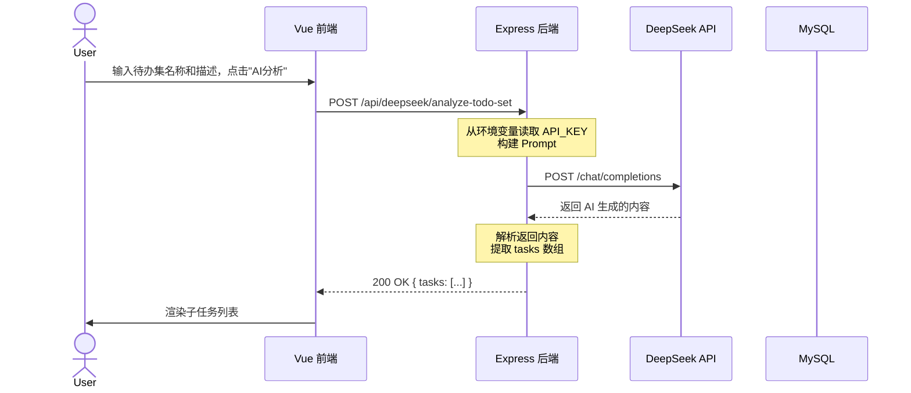

# 项目架构学习指南

> 本文档用于帮助你从「学生作业」过渡到「准生产级项目」，为中小厂前端实习做准备。

---

## 一、当前项目架构分析

### 1.1 整体架构图

### 1.2 核心数据流

#### 场景：AI 分析待办集 → 生成子任务

---

## 二、下一步架构优化方向（中小厂重点考察）

| 优先级 | 优化方向 | 具体做法 | 学习要点 |
|--------|----------|----------|----------|
| 🔴 高 | **安全加固** | 1. SQL注入防护 2. XSS防护 3. 请求限流 4. 密码加密 | OWASP Top 10 |
| 🟡 中 | **错误处理** | 1. 统一错误响应格式 2. 错误日志记录 3. 前端友好提示 | 异常处理设计模式 |
| 🟡 中 | **性能优化** | 1. 前端路由懒加载 2. 图片懒加载 3. API响应缓存 | Web性能优化 |
| 🟢 低 | **工程化** | 1. ESLint/Prettier 2. Git提交规范 3. CI/CD | 现代前端工程化 |

---

## 三、面试必背知识点

### 3.1 关于项目架构的高频问题

| 面试问题 | 回答要点 |
|----------|----------|
| **项目中你做了什么架构决策？** | 1. 为什么选 Vue 3 不选 React？ 2. 为什么用 Express 不用 Nest/Koa？ 3. 为什么选 MySQL 不用 MongoDB？ |
| **DeepSeek API 代理为什么安全？** | 1. 前端无法直接接触密钥 2. 后端可以做鉴权、限流、审计 3. 符合最小权限原则 |
| **数据库为什么这么设计？** | 1. 表之间的关联关系 2. 索引策略 3. 范式与反范式的权衡 |
| **如何优化 API 响应速度？** | 1. 数据库查询优化 2. 缓存策略 3. 分页/限流 |

### 3.2 项目亮点 STAR 话术模板

**S (场景)**：在做待办事项管理工具时，发现前端直接调用第三方 API 有安全隐患。

**T (任务)**：需要重构架构，保证 API 密钥安全，同时保留 AI 功能。

**A (行动)**：
1. 采用 **后端代理模式**，新增 deepseek 路由
2. 使用 **dotenv** 管理环境变量，密钥存储在后端
3. 使用 Node.js 内置 `https` 模块替代 axios，减少依赖
4. 实现了输入验证和降级策略（API 失败时返回模拟数据）

**R (结果)**：
- 彻底消除了密钥泄露风险
- 增加了请求限流能力
- 提升了服务稳定性

---

## 四、技术栈深挖清单

### Vue 3 相关
- [ ] 理解 Composition API vs Options API
- [ ] 理解响应式原理（Proxy vs Object.defineProperty）
- [ ] Vue 组件通信方式（props/emit, provide/inject, Pinia/Vuex）
- [ ] 虚拟 DOM 和 diff 算法

### Node.js / Express 相关
- [ ] Express 中间件机制
- [ ] RESTful API 设计规范
- [ ] 数据库连接池
- [ ] 错误处理中间件

### MySQL / Sequelize 相关
- [ ] SQL 基础（CRUD, JOIN, 索引）
- [ ] 事务概念
- [ ] ORM 的优缺点
- [ ] N+1 查询问题

### 前端工程化相关
- [ ] Vite 的工作原理（为什么比 Webpack 快？）
- [ ] ESLint 和 Prettier 的配置
- [ ] npm scripts 的使用
- [ ] Git 工作流

---

## 五、简历项目描述模板

### 项目名称
Todo Schedule App - 全栈待办事项与日程管理工具

### 技术栈
Vue 3 + Element Plus + Vite + Node.js + Express + MySQL + Sequelize + DeepSeek API

### 项目描述
1. 开发了一款集待办管理、日程安排、专注计时、数据统计于一体的全栈应用
2. 采用前后端分离架构，前端使用 Vue 3 + Element Plus，后端使用 Express + MySQL
3. **核心亮点**：重构第三方 API 调用方式，采用后端代理模式，彻底解决 API 密钥硬编码安全问题
4. 实现了 AI 辅助功能，通过 DeepSeek API 自动分析待办集并生成子任务和时间估算

### 个人职责
- 负责前端组件设计与开发，实现了完整的待办、日程、统计等功能模块
- 设计并实现后端 RESTful API，使用 Sequelize ORM 管理 MySQL 数据库
- **架构优化**：实施安全重构，将第三方 API 调用从前端迁移到后端代理，消除密钥泄露风险
- 实现输入验证、错误处理、降级策略等保障服务稳定性的机制

---

## 六、推荐学习资源

### 架构相关
- 📚 《凤凰架构》
- 📚 《企业应用架构模式》
- 🎥 B站 - "系统架构设计"

### 前端相关
- 📖 Vue 3 官方文档
- 📖 Vue Mastery (免费教程)
- 📚 《Vue.js 设计与实现》

### 后端相关
- 📖 Express 官方文档
- 📖 Sequelize 官方文档
- 📚 《Node.js 实战》

### 数据库相关
- 📖 MySQL 官方文档
- 🎥 B站 - "MySQL 实战 45 讲" (极客时间)
